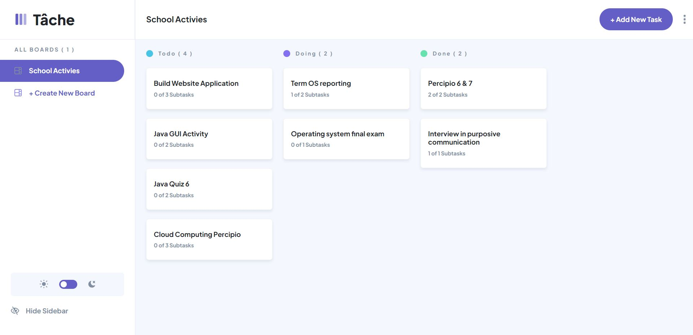

## Table of contents

- [Overview](#overview)
  - [The challenge](#the-challenge)
  - [Screenshot](#screenshot)
  - [Links](#links)
  - [Built with](#built-with)
  - [What I learned](#what-i-learned)
  - [Continued development](#continued-development)
- [Author](#author)

## Overview

### The challenge

Users should be able to:

- View the optimal layout for the app depending on their device's screen size
- See hover states for all interactive elements on the page
- Create, read, update, and delete boards and tasks
- Receive form validations when trying to create/edit boards and tasks
- Mark subtasks as complete and move tasks between columns
- Hide/show the board sidebar

### Screenshot

### Links

- Solution URL: [Solution Here](https://github.com/jeffabenoja/Task-Mangement.git)
- Live Site URL: [Live Site Here](https://jeffabenoja.github.io/Task-Mangement/)

### Built with

- Semantic HTML5 markup
- CSS custom properties
- Flexbox
- CSS Grid
- Mobile-first workflow
- JavaScript

### What I learned

I learn a lot when I'm building this application. Building a reusable code, css, bootstrap and other function in javascript. 

### Continued development

I was planning to rebuild this project using react, and making it a full stack application.

### Useful resources

- css-tricks.com
- StackOverflow

## Author

- Facebook - [@wazsupabenoja](https://www.facebook.com/wazsupabenoja)
- LinkedIn - [@jeffabenoja](https://www.linkedin.com/in/jeffabenoja/)

